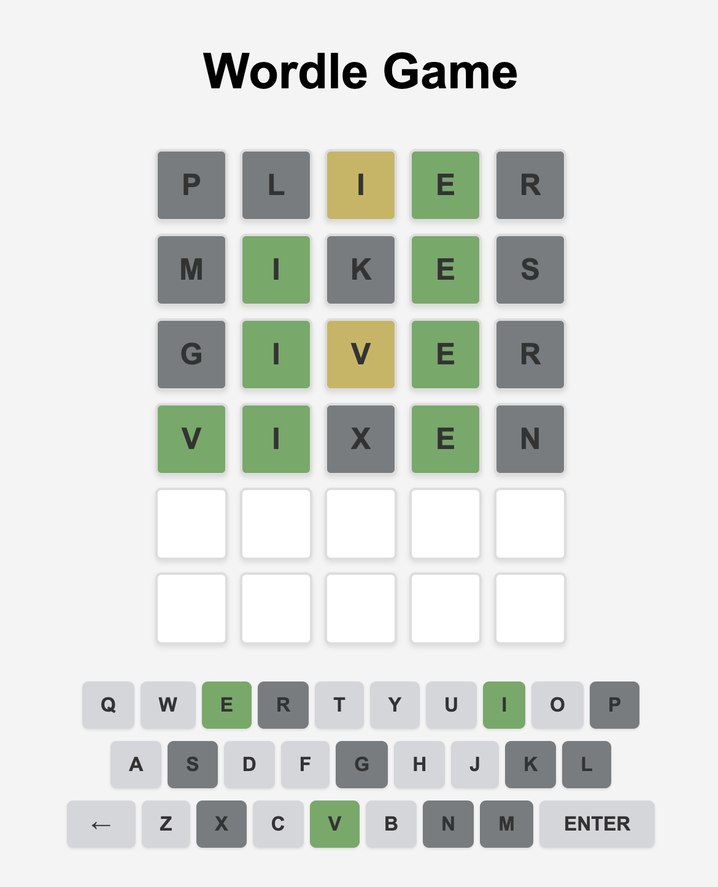
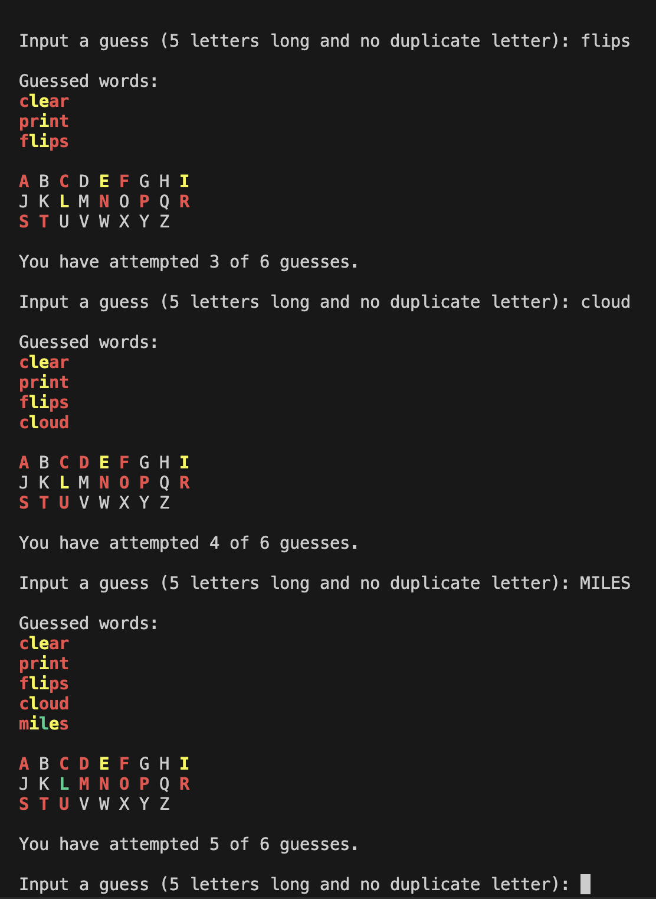

# Wordle Game

> A browser-based Wordle game clone built with **HTML**, **CSS**, and **JavaScript**, and extended versions using **Python** and **Java** for terminal-based gameplay.

## 📸 Screenshots
<!--  -->
<!--  -->


---

## Table of Contents
1. [About the Project](#about-the-project)
2. [Technologies Used](#technologies-used)
3. [Setup Instructions](#setup-instructions)
4. [How to Play](#how-to-play)
5. [Future Enhancements](#future-enhancements)
6. [License](#license)

---

## About the Project
This project is a **Wordle game clone** that allows users to guess a five-letter word within six attempts. It has been developed in three stages:
- **Initial Terminal Versions**: Implemented in Python (`Wordle_game_python.py`) and Java (`WordleGuessingGame.java`).
- **Browser-Based Game**: Developed using modern web technologies, including an interactive user interface.

---

## Technologies Used
### Core
- **Browser**: HTML, CSS, JavaScript
- **Terminal**: Java, Python

---

## Setup Instructions
Follow these steps to run the game locally:

### 1. Clone Repository
```bash
git clone https://github.com/anishsaraf101/Wordle-Game
cd wordle-clone
```

### 2. Start a Local Python Server
```bash
cd browser_game
python -m http.server 8000
```
This ensures JavaScript code can open related text files.

### 3. Start a Local Python Server
Click the browser link in the terminal or copy and paste the link into a modern browser.

### 4. Load game in Terminal (Optional)
Navigate to terminal directory and type either:
```bash
python3 Wordle_game_python.py
```
OR
```bash
javac WordleGuessingGame.java
java WordleGuessingGame
```
for Python or Java implementation, respectively.

---

## How to Play
1. **Objective**: Guess the hidden 5-letter word within 6 attempts.
2. **Rules**:
   - Green tiles: Correct letter in the correct position.
   - Yellow tiles: Correct letter, wrong position.
   - Gray tiles: Incorrect letter.
3. Use the on-screen keyboard or your physical keyboard to enter guesses.
4. Press **Enter** to submit a guess and **Backspace** to delete letters.

---

## Future Enhancements
- **UUID**: Give each unique user their own user ID to track gameplay history
- **Database**: Implement a database to store each user
- **Login System**: Optionally allow account creation for secure tracking of accounts.
- **Webpage Additions**: Use a python flask backend to add page(s) to display user's gameplay history

---

## License
This project is licensed under the MIT License.

---
